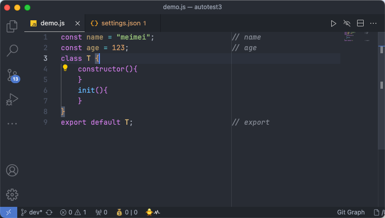

# Align Tail Comments

Align comments after each line of code to the ruler.If the line comment is not after the code it is not affected, since this is the start of a block.

## USE

- Install this extension；
- `（ctrl|cmd）+shift+p` -> `Align Tail Comments`；